**Цель работы:** Сформировать практические навыки трансформации аналитических данных в наглядные интерактивные визуальные формы, освоить принципы построения дашбордов для поддержки принятия управленческих решений с использованием табличных процессоров и специализированных BI-инструментов.

**Описание бизнес-задачи**

Бизнес-задача:

Анализ эффективности веб-сайта и маркетинговых каналов с целью оценки поведения пользователей, выявления факторов, влияющих на конверсию, и анализа источников выручки.

Ключевые вопросы дашборда:

1. Как изменяется количество сессий пользователей во времени?
2. Какие источники трафика приводят больше всего пользователей и дают наибольшую конверсию?
3. Какие возрастные группы чаще совершают конверсии?
4. Как устройство пользователя влияет на поведение (время на сайте, страницы)?
5. Какой доход генерируется различными маркетинговыми каналами?

Ключевые показатели для дашборда:

* Общее количество сессий
* Конверсия (CR)
* Общая выручка
* Среднее время на сайте

Для детализации я применю следующие срезы: по странам, по полу, по месяцам.

**Описание источника данных**

Данные для работы я взяла с сайта Kaggle. <https://www.kaggle.com/datasets/sandeep1080/bassburst/data>
Этот набор данных содержит информацию о конверсии веб-сайта в продажах Bluetooth-колонок за январь-февраль 2025 года. В нем отслеживаются пользовательские сессии на различных вариантах целевых страниц с основной целью анализа коэффициентов конверсии, поведения пользователей и других факторов, влияющих на продажи. Он включает показатели вовлеченности пользователей, такие как время, проведенное на сайте, посещенные страницы, тип устройства, способы входа в систему и географическая информация.

Строк: 30000

Столбцы: 24

user\_id: Уникальный идентификатор каждого посетителя.

session\_id: Уникальный идентификатор каждой сессии или посещения.

sign\_in: Указывает, вошел ли пользователь через электронную почту или использовал гостевой доступ.

name: Имя посетителя.

demographic\_age: Возраст посетителя (от 14 до 80 лет).

demographic\_age\_group: Возрастная группа посетителя: «Подростки», «Взрослые», «Пожилые».

demographic\_gender: Пол посетителя (Мужской, Женский, Не ответил).

email: Адрес электронной почты пользователя (если вошел через электронную почту).

location: Город, в котором находится посетитель.

country: Страна, соответствующая местоположению.

device\_type: Тип используемого устройства (Мобильный телефон, Настольный компьютер, Планшет).

timestamp: Время начала сессии.

variant\_group: Вариант дизайна целевой страницы, который видел пользователь (Vibrant, Cold, Heat).

time\_spent: Общее время (в минутах), проведенное пользователем на целевой странице.

pages\_visited: Количество страниц, просмотренных пользователем за сессию.

conversion\_flag: Бинарный флаг (0/1), указывающий, совершил ли пользователь конверсию (зарегистрировался или совершил покупку).

conversion\_type: Тип достигнутой конверсии (регистрация или покупка).

traffic\_source: Источник трафика.

product\_purchased: Список приобретенных товаров (если применимо).

revenue: Общий доход, полученный от транзакции (если была совершена покупка).

payment\_type: Использованный способ оплаты (карта или наложенный платеж).

card\_type: Тип карты, если оплата была произведена картой (Amex, Visa, Mastercard).

coupon\_applied: Был ли применен купон (Да/Нет).

bounce\_flag: Указывает, была ли сессия сбойной (посещена только одна страница).

**Загрузка данных**

Теперь перейдем к этапу загрузки и обработки данных.

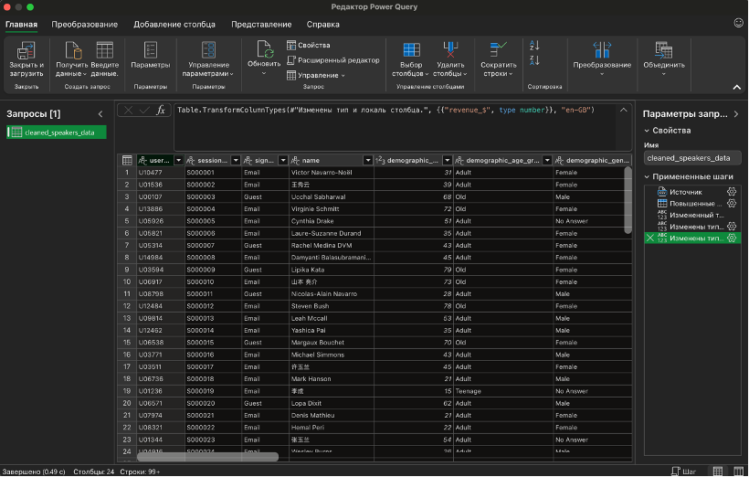

Рис.1 – Загрузка данных через Power Query

В загруженной таблице некоторые числовые параметры были записаны с точкой, поэтому с помощью встроенного редактора, я заменила точки на запятые.

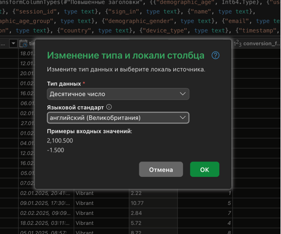

Рис.2 – Изменение типа данных

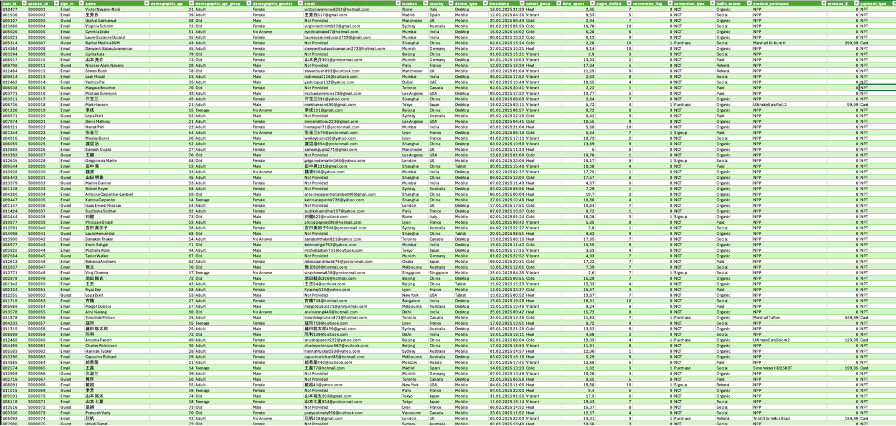

Рис.3 – Внешний вид таблицы

Загруженная таблица уже является плоской, поэтому можно с ней работать дальше.

**Макет дашборда**

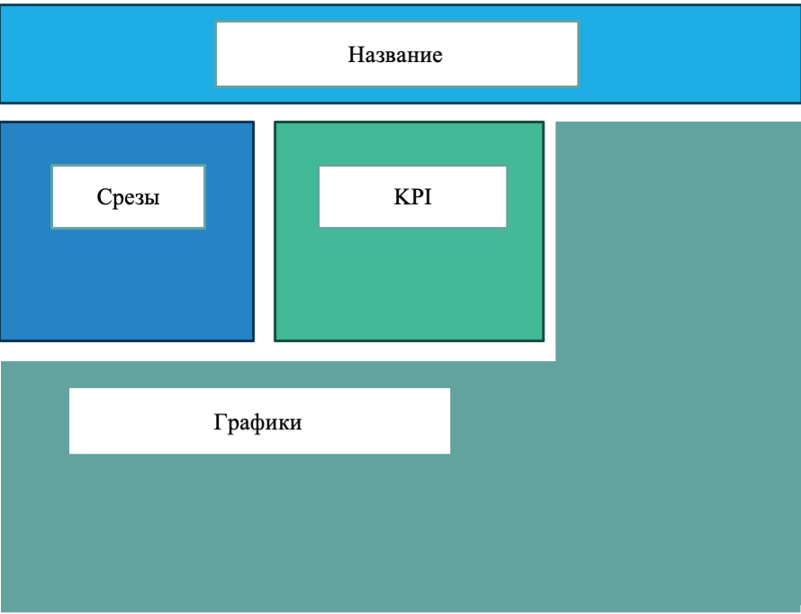

Рис.4 – Макет дашборда

Блоки я расположила таким образом, чтобы самые важные параметры бросались в глаза первыми, но при этом достаточно места оставалось под графики.

**Обоснование выбора типов визуализации**

В таблице ниже описаны основные графики и KPI, которые я буду использовать в дашборде.

Таблица 1. Спецификация дашборда

| № | Наименование блока/элемента | Тип визуализации | Источник данных (диапазон/таблица) | Назначение/ Аналитический вопрос |
| --- | --- | --- | --- | --- |
| 1 | Общая выручка | Карточка (число) | =СУММ (revenue\_$) | Отображение итогового KPI |
| 2 | |  | | --- | | CR (конверсия) | | Карточка (число) | =СУММ(conversion\_flag)/СЧЕТ(session\_id) | Какая доля пользователей совершили целевое действие |
| 3 | Количество сессий | Карточка (число) | =СЧЕТ(session\_id) | Сколько пользователей посетило сайт |
| 4 | Среднее время проведенное на странице | Карточка (число) | Сводная по времени | Оценка вовлеченность покупателей (поведенческий фактор для SEO) |
| 5 | Динамика сессий и конверсий | Линейный график | Сводная по датам | Как меняется трафик и количество целевых действий по дням |
| 6 | Трафик по источникам | Столбчатая диаграмма | Сводная CR | Какие каналы приводят больше пользователей и конверсий |
| 7 | Выручка по источникам | Круговая диаграмма | Сводная по выручке | Какие источники трафика приносят наибольшую прибыль |
| 8 | Количество посещаемых страниц по устройствам | Линейчатая диаграмма | Сводная по страницам | Выявление недоработок в интерфейсе сайта на каком-либо источнике |
| 9 | Время, проведенное на сайте по устройствам | Линейчатая диаграмма | Сводная по времени | Выявление недоработок в интерфейсе сайта на каком-либо источнике |
| 10 | Конверсия по возрастным группам | Круговая диаграмма | Сводная по возрасту | Какие возрастные группы чаще совершают конверсии |

Для параметров, где важна возможность наглядного сравнения по каким-то критериям и между друг другом, я выбрала столбчатую диаграмму (зависимость числа конверсий и пользователей от источника трафика) и линейчатые (влияние устройства на время и количество посещенных страниц на сайте). Для параметров, где хочется показать долю в общем объеме, использовались круговые диаграммы. Для оценки динамики - линейный график. Он выбран из-за того, что система имеет разные состояния в каждые дни, а дней много, с помощью других графиков без сегментации наглядно показать динамику не получится.

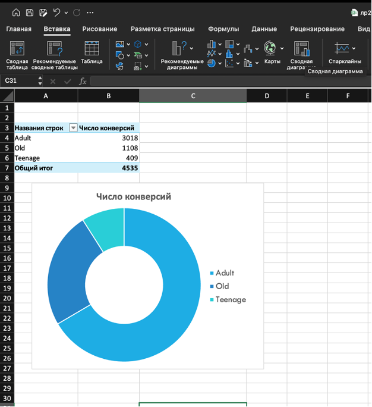

Рис.5 – Пример создания сводной диаграммы

После того, как я определилась с содержанием дашборда, я приступила к созданию диаграмм. Сначала я сделала несколько сводных таблиц, отдельную для каждого графика, а далее с помощью кнопки Сводная диграмма создала к каждой таблицы диаграмму. Выбрала единый стиль диграмм с помощью Разметка страницы –> Тема, добавила название и подредактировала размеры шрифта, далее скопировала и вставила все графики на отдельный лист. После добавления графиков, я скрыла ненужные столбцы и убрала сетку для красивой визуализации.

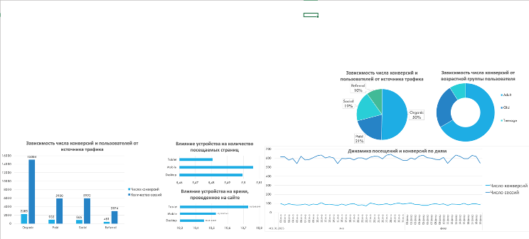

Рис.6 – Загрузка графиков на дашборд

KPI я решила разместить в отдельном блоке «Итоговые значения». Оформила его в подходящих цветах. В ячейки добавила ссылки на значения с помощью формул. Там, где значения были частью сводной таблицы, я перенесла значения с помощью = в соседнюю ячейку и также добавила в нужные ячейки на дашборде.

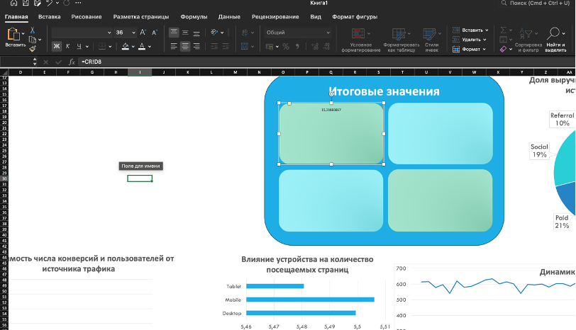

Рис.7 – Оформление KPI

**Описание добавленной интерактивности**

Я выбрала одну из таблиц, во вкладке анализ сводной таблицы с помощью кнопки Вставить срез, я открыла окно со вставкой срезов. Срезы я решила сделать по полу, стране и месяцу. Выбор пал именно на эти срезы, так как в графиках эти данные в явном виде не используются, но детализация по этим признакам поможет ответить на ряд аналитических вопросов.

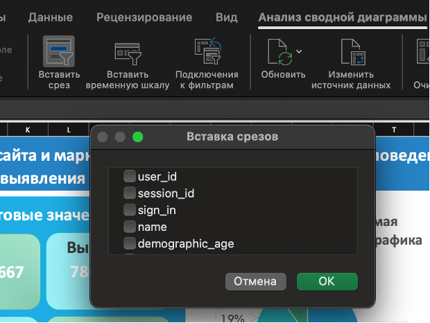

Рис.8 – Создание срезов

Далее с помощью вкладки Срез, Подключение к отчетам, я подключила каждый срез к каждой сводной таблице и KPI (они автоматически подключились, так как KPI берутся из сводной таблицы).

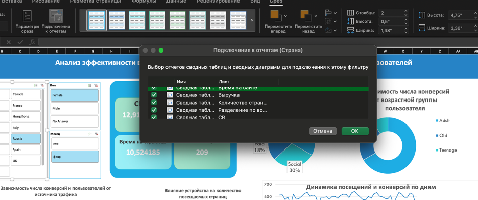

Рис.9 – Подключение срезов к другим таблицам

**Итоговый дашборд**

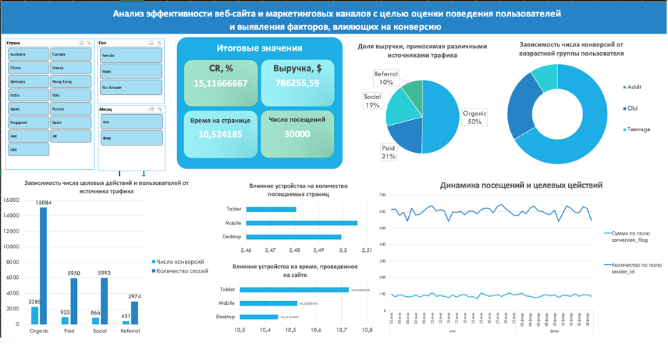

Рис.10 – Итоговый дашборд

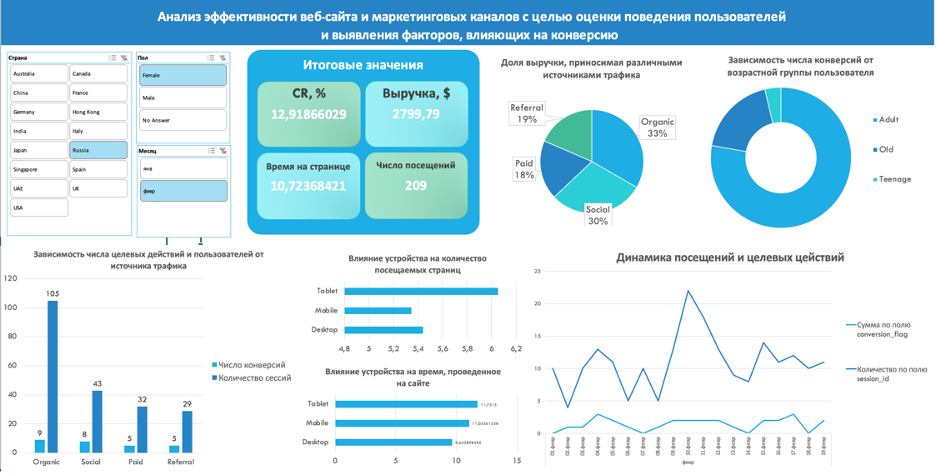

Рис.11 – Пример применения срезов

Таблица 2. Проверка качества дашборда

| Критерий | Проверка | Результат (ОК/Требуется доработка) |
| --- | --- | --- |
| Все ли KPI отображаются корректно? | Изменить срез и проверить значения | ОК |
| Обновляются ли все графики при выборе среза? | Выбрать значение в срезе | ОК |
| Читаемость | Не перегружен ли дашборд цветами? | ОК |
| Соответствие цели | Отвечает ли дашборд на поставленные вопросы? | ОК |

**Выводы**

В ходе выполнения лабораторной работы был разработан интерактивный дашборд для анализа эффективности веб-сайта и маркетинговых каналов. Созданный дашборд позволяет наглядно отслеживать ключевые показатели: количество пользовательских сессий, конверсии, выручку, а также анализировать данные в разрезе различных характеристик аудитории.

Анализ данных позволяет сделать следующие бизнес-инсайты. Во-первых, можно определить источники трафика, которые приводят наибольшее количество пользователей и обеспечивают наибольшую конверсию, в общем случае это оказался органический трафик. Это помогает выявить наиболее эффективные маркетинговые каналы и оптимизировать рекламный бюджет. Во-вторых, анализ возрастных групп пользователей показывает, что взрослая аудитория чаще совершает заказы, это позволит более точно настраивать маркетинговые кампании и рекламные сообщения. В-третьих, сравнение поведения пользователей на разных устройствах позволяет выявить различия в активности пользователей разных устройств и при необходимости улучшить пользовательский интерфейс сайта, но в моем случае метрики примерно равны, поэтому выявить конкретное направление для улучшения сложно. С помощью срезов, случайным образом, я определила, что в январе хорошо сработал social канал трафика на женской аудитории из России, поэтому стоит обратить внимание на эту рекламную кампанию и возможно повторить ее.

В дальнейшем данный дашборд можно улучшить, добавив в датасет дополнительные показатели, например затраты на разные источники трафика и с помощью этого посчитать дополнительные метрики, например ROMI, добавить новые графики, например топ активных стран, топ продаваемых товаров, а также расширить интерактивность.
